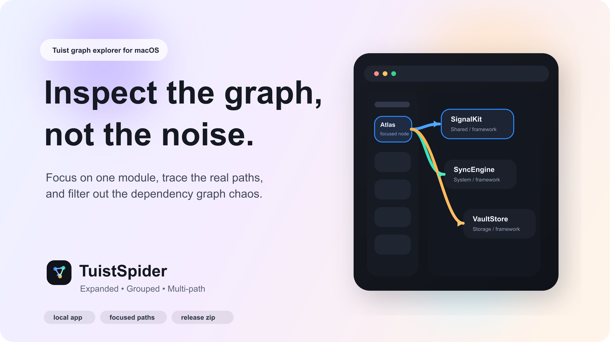
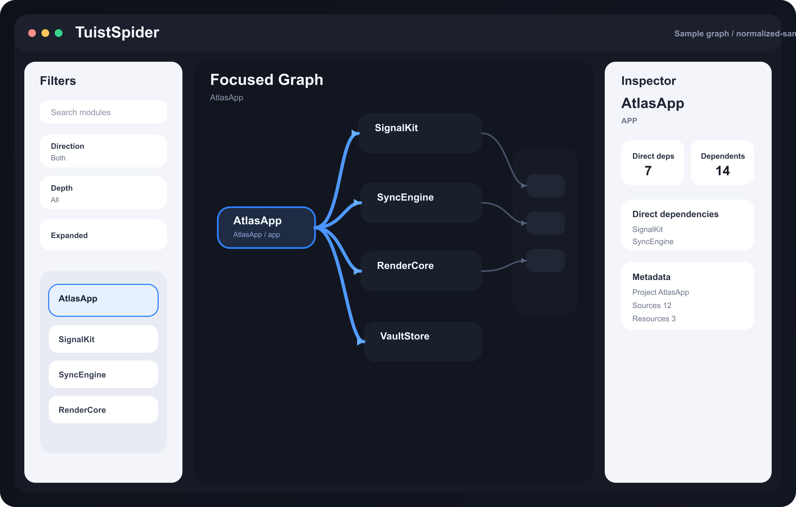
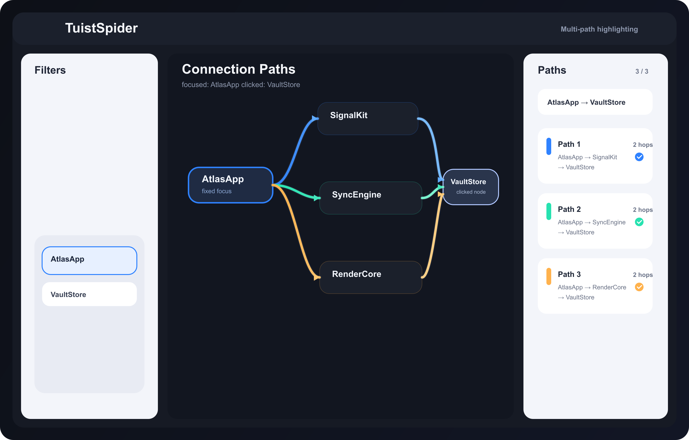

# TuistSpider

[English](./README.md) | [한국어](./README.ko.md)



대규모 [Tuist](https://github.com/tuist/tuist) 모듈 그래프를 탐색하기 위한 네이티브 macOS 앱입니다.

Tuist의 전체 그래프 export는 유용하지만, 모듈 수가 많아질수록 한 번에 읽기 어려워집니다. `TuistSpider`는 실제로 자주 하는 작업에 집중합니다. 하나의 모듈을 기준으로 잡고, 방향과 깊이로 범위를 줄이고, 실제 연결 경로를 확인하고, 나머지는 숨기는 흐름입니다.

## 왜 만들었나

큰 의존성 그래프에서 대부분의 질문은 "전부 보여줘"가 아닙니다.

- 이 모듈은 무엇을 의존하고 있지?
- 어떤 모듈이 이 모듈을 의존하지?
- 모듈 A와 B는 어떤 경로로 연결되지?
- 지금 내가 봐야 하는 정확한 경로는 무엇이지?

`TuistSpider`는 이런 질문을 빠르게 풀기 위해 만들어졌습니다.

## 주요 기능

- 앱에서 Tuist 프로젝트를 직접 열고 `tuist graph --format json` 실행
- export된 그래프 JSON 파일 직접 로드
- 하나의 모듈을 기준으로 방향과 깊이 필터링
- `metadata.tags`, 프로젝트 경로, 타깃 이름, product 힌트를 이용한 레이어 자동 분류
- `.tuist-spider/layers.json` 기반 프로젝트별 레이어 분류 저장
- Tuist manifest를 수정하지 않고 Inspector에서 internal target 레이어 수정
- read-only `metadata.tags`, applied layer, suggested layer, classification source 동시 표시
- 외부 의존성 on/off 토글
- 두 가지 표현 방식 지원
  - `Expanded`: 모듈별 카드 표시
  - `Grouped`: 레벨별 카드 표시
- `Expanded` 모드에서 레이어 밴드를 그려 같은 레이어 모듈을 시각적으로 정렬
- 왼쪽 선택 상태를 유지한 채 그래프에서 다른 노드 클릭 가능
- 기준 노드와 클릭한 노드 사이의 가시 경로 여러 개 탐색
- 경로별 색상 구분 및 개별 토글
- `선택 경로만 보기`로 활성 경로만 화면에 유지
- 장애물 회피 및 간선 trunk 겹침 완화 라우팅
- 그래프 위에서 의존 방향 직접 확인
- macOS 네이티브 확대/축소, 팬 지원

## 스크린샷

### 기준 모듈 중심 탐색



### 다중 경로 추적



## 다운로드

저장소:

- [github.com/leejungyeob/TuistSpider](https://github.com/leejungyeob/TuistSpider)

최신 릴리즈:

- [github.com/leejungyeob/TuistSpider/releases/latest](https://github.com/leejungyeob/TuistSpider/releases/latest)

권장 다운로드 파일:

- `TuistSpider.dmg`

### 릴리즈에서 설치하기

1. [최신 릴리즈](https://github.com/leejungyeob/TuistSpider/releases/latest)를 엽니다.
2. `TuistSpider.dmg`를 다운로드합니다.
3. DMG를 엽니다.
4. `TuistSpider.app`을 `Applications`로 드래그합니다.
5. `Applications`에서 앱을 실행합니다.

서명되지 않은 앱이라 macOS가 차단하면:

1. `TuistSpider.app`을 우클릭합니다.
2. `Open`을 선택합니다.
3. 경고 창에서 다시 `Open`을 클릭합니다.

또는 quarantine을 직접 제거할 수 있습니다:

```bash
xattr -dr com.apple.quarantine /Applications/TuistSpider.app
```

## 빠르게 시작하기

로컬에서 앱 실행:

```bash
./scripts/run_mac_app.sh
```

생성된 Xcode 프로젝트 열기:

```bash
./scripts/open_mac_app.sh
```

릴리즈 DMG 빌드:

```bash
./scripts/mac/build-release-dmg.sh
```

릴리즈 ZIP 빌드:

```bash
./scripts/mac/build-release-zip.sh
```

## 동작 방식

### 1. 그래프 불러오기

- `프로젝트 열기`로 Tuist 프로젝트 루트를 엽니다.
- 또는 `JSON 열기`로 그래프 JSON 파일을 직접 불러옵니다.
- 앱은 기준 모듈을 유지한 채 주변 그래프만 탐색할 수 있게 해줍니다.

### 2. 그래프 범위 줄이기

- 왼쪽 사이드바에서 기준 모듈을 선택합니다.
- `양방향`, `의존하는 쪽`, `의존받는 쪽` 중 방향을 선택합니다.
- 필요하면 깊이를 제한합니다.
- 외부 라이브러리까지 보고 싶을 때 `외부 의존성 포함`을 켭니다.

### 3. 표현 방식 바꾸기

- `펼침`
  - 모듈 하나를 카드 하나로 보여줍니다.
  - 같은 레이어 모듈은 레이어 밴드 안에 정렬됩니다.
- `계층`
  - 같은 레벨의 모듈을 하나의 카드로 묶습니다.
  - 레벨 카드를 클릭하면 해당 레벨의 모듈 구성을 Inspector에서 볼 수 있습니다.

### 4. 프로젝트 레이어 확인 및 조정

- TuistSpider는 먼저 `metadata.tags`의 `layer:feature` 같은 값을 확인합니다.
- 명시 레이어가 없으면 프로젝트 경로, 타깃 이름, product를 이용해 자동 추론합니다.
- `Expanded` 모드에서는 레이어별 구획을 그려 같은 레이어 모듈이 정렬되도록 보여줍니다.
- internal target을 선택하면 다음 정보를 볼 수 있습니다.
  - `Applied Layer`
  - `Suggested Layer`
  - `Applied Source`
  - `Suggested Source`
  - read-only `metadata.tags`
- Inspector에서 applied layer를 직접 변경할 수 있습니다.
- 자동 분류 결과가 마음에 들지 않으면 커스텀 레이어를 입력해 저장할 수 있습니다.
- `Reset to Suggested`로 현재 자동 제안값으로 되돌릴 수 있습니다.

### 5. 레이어 분류 저장

- TuistSpider는 프로젝트별 레이어 분류를 아래 파일에 저장합니다:

```text
<project-root>/.tuist-spider/layers.json
```

- 같은 프로젝트나 그래프를 다시 열면 저장된 값이 가장 먼저 적용됩니다.
- 새 타깃은 자동 분류 후 스냅샷에 동기화됩니다.
- 삭제된 타깃은 스냅샷에서 자동으로 제거됩니다.
- 외부 의존성은 스냅샷 저장 대상이 아닙니다.

### 6. 두 모듈 사이 경로 추적

- 왼쪽에서 기준 노드를 선택합니다.
- 그래프에서 다른 노드를 클릭합니다.
- TuistSpider가 두 노드 사이의 가시 경로를 여러 개 찾습니다.
- 각 경로는 서로 다른 색을 가집니다.
- Inspector에서 다음 작업을 할 수 있습니다.
  - 모든 경로 보기
  - 모든 경로 숨기기
  - 특정 경로만 토글
  - `선택 경로만 보기`로 활성 경로만 유지
  - path-only 모드에서 `shift + click`으로 여러 경로 추가/제거
  - 결과가 잘린 경우 `더 보기`로 경로 수 확장

## 조작 방법

- 우측 상단 확대/축소 컨트롤
- 트랙패드 pinch zoom
- `space + drag`로 팬
- `control + wheel`로 확대/축소
- path row에서 `shift + click`으로 현재 path-only 선택에 추가/제거

## 레이어 분류 규칙

TuistSpider는 아래 우선순위로 모듈 레이어를 결정합니다.

1. `.tuist-spider/layers.json`에 저장된 프로젝트 스냅샷
2. `metadata.tags`의 `layer:<name>`
3. 프로젝트 경로 추론
4. 타깃 이름 추론
5. product 또는 test-target 추론
6. `Unclassified`

참고:

- 레이어로 인식하는 metadata tag 형식은 `layer:<name>`뿐입니다.
- 그 외 metadata tag는 Inspector에서 read-only tag로 노출됩니다.
- `layer:` 태그가 여러 개면 첫 번째 값만 사용하고 warning을 표시합니다.

## 외부 의존성 판별 규칙

`외부 의존성 포함` 토글은 아래 조건 중 하나라도 맞으면 외부 의존성으로 봅니다.

- dependency kind가 `package`, `packageProduct`, `external`, `sdk`, `framework`, `xcframework`, `library` 계열인 경우
- resolved path가 프로젝트 루트 바깥인 경우
- path에 `checkouts`, `SourcePackages`, `.build`, `.cache`, `CocoaPods`, `Carthage` 같은 마커가 포함된 경우

이 규칙으로 Tuist가 `project/target` 형태로 풀어줘도 서드파티 의존성을 비교적 안정적으로 분리합니다.

## 요구 사항

- macOS
- Xcode
- Tuist CLI 설치

Tuist 설치:

```bash
brew install tuist
```

GUI에서 실행된 앱이 `tuist`를 찾지 못하면:

```bash
TUIST_EXECUTABLE=/opt/homebrew/bin/tuist ./scripts/run_mac_app.sh
```

## 릴리즈 워크플로우

최종 사용자용 배포 아티팩트는 DMG를 기준으로 합니다.

1. 아래 스크립트를 실행합니다:

```bash
./scripts/mac/build-release-dmg.sh
```

2. `dist/TuistSpider.dmg`를 [GitHub Releases](https://github.com/leejungyeob/TuistSpider/releases)에 업로드합니다.
3. 릴리즈 URL을 공유합니다.

단순 `.app.zip` 파일이 필요한 내부 테스트나 임시 배포 상황에서는 ZIP 빌드를 사용하면 됩니다.

## 저장소 구조

- `App/`
  - SwiftUI macOS 앱
- `Project.swift`
  - TuistSpider 자체의 Tuist manifest
- `scripts/run_mac_app.sh`
  - generate, build, launch까지 수행
- `scripts/open_mac_app.sh`
  - generate 후 Xcode 프로젝트 오픈
- `scripts/mac/build-release-dmg.sh`
  - 릴리즈 앱을 빌드하고 drag-to-Applications DMG로 패키징
- `scripts/mac/build-release-zip.sh`
  - 릴리즈 앱을 빌드하고 ZIP으로 패키징
- `examples/TuistFixture`
  - 로컬 테스트용 샘플 Tuist 프로젝트

## 라이선스

MIT. 자세한 내용은 [LICENSE](./LICENSE)를 참고하세요.
